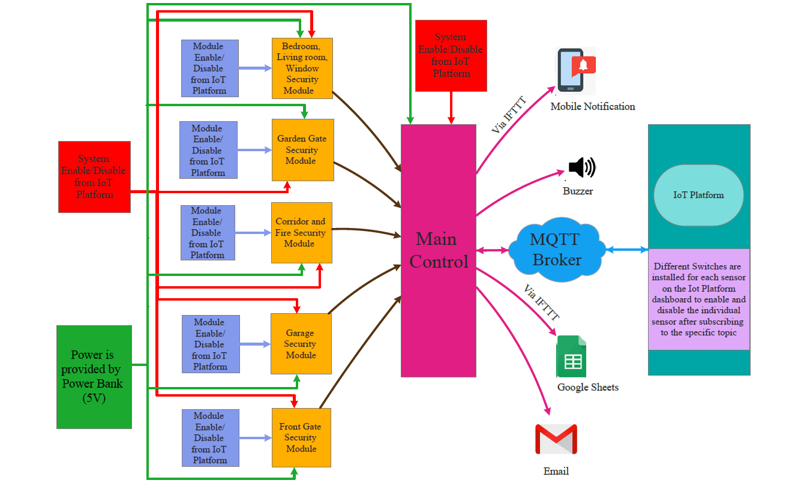
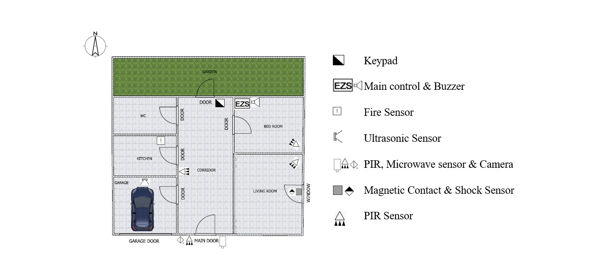
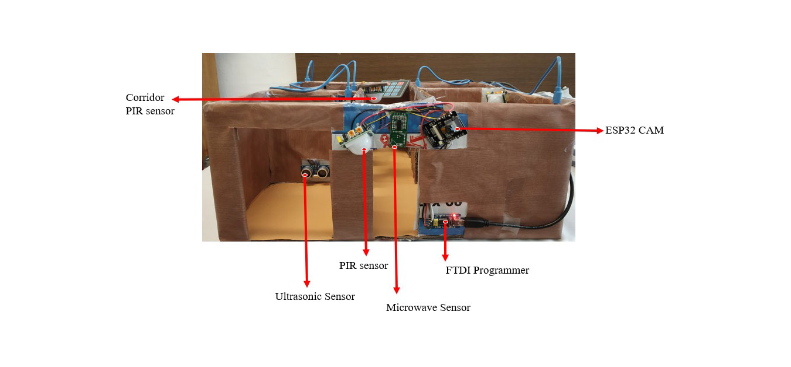
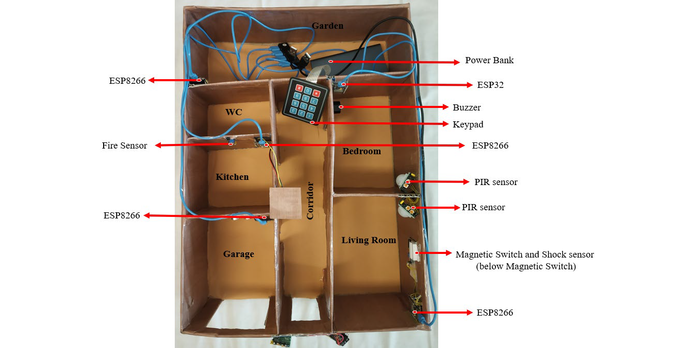
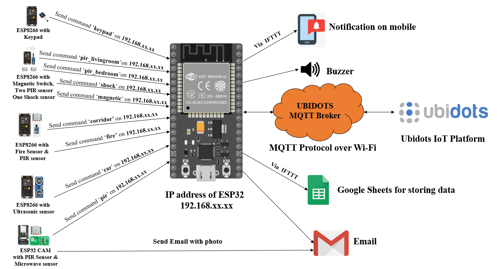
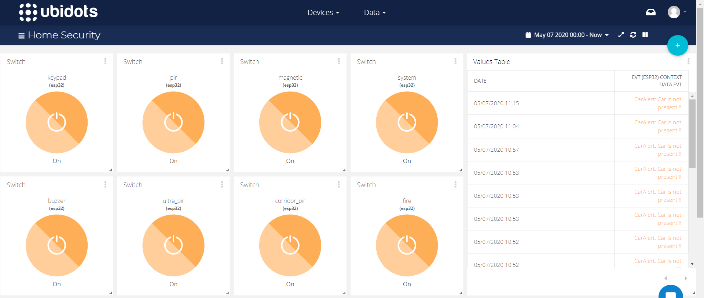

# Home-Security-System

List of Components and Technologies Used:
ESP32, ESP8266, ESP32 CAM, Microwave Sensor, Ultrasonic Sensor, Magnetic Switch, Shock Sensor, PIR Sensor, Fire Sensor, Keypad, Wi-Fi, MQTT, Ubidots, IFTTT, Email, Google Sheets

Instructions to use Source Code:
1) Before flashing the code to the microcontrollers, it is required to add the SSID and Password of the Wi-Fi network. In place of TOKEN, add the Default Token that can be obtained from API Credentials from the Ubidots account.
2) For controlling the devices from Ubidots IoT Platform, login in on Ubidots.com.
3) In main_control.ino and PIR_Microwave_Camera.ino file it is required to add sender’s Gmail id and password and recipient Gmail id.
4) For getting notification on mobile, install IFTTT mobile application.

Files Description:
1. flame_corridor_pir: For the Flame Sensor and Corridor PIR sensor.
2. garden_gate_final: For Garde Gate (Keypad)
3. main_control: For Main controller (with buzzer)
4. PIR_Microwave_Camera: For Front Gate Security (PIR and Microwave sensor)
5. shock_pir_pir_mag: For Living room and Bedroom PIR sensor, Magnetic Switch and shock sensor for window security.
6. Ultra_Garage: For Garage Security (Ultrasonic Sensor)

Diagrams:

